  

  

## Образование

**УрФУ, ИРИТ-РТФ** — Алгоритмы искусственного интеллекта (2025–2029)  
**Яндекс.Практикум** — Backend-разработчик (2025–2026)

  

## Стек

| Категория | Технологии                                                      |
| --------- |-----------------------------------------------------------------|
| **Языки и фреймворки** | Python (asyncio, OOP), Java..., Django, FastAPI, Pydantic, NumPy, Pandas |
| **AI и LLM** | LangGraph, LangChain, Scikit-learn, AI-агенты, RAG, Prompt Engineering, API LLM |
| **Инструменты и БД** | PostgreSQL, Векторные БД (ChromaDB), uv, Git, Docker, YARA, Sigma |
| **Инфраструктура** | Docker Compose, CI/CD, Kafka (aiokafka, DLQ), Vector |

  

## Проекты

### WaveScan — on-premise AI-анализатор логов кибербезопасности ([Статья на Хабре](https://habr.com/ru/articles/1063584/))
*Проектный практикум УрФУ*

Спроектировал AI-ядро пайплайна потокового анализа логов: Vector → Kafka → LangGraph DAG → Postgres, LLM-анализ совмещён с сигнатурными движками YARA/Sigma в одном графе.

- **8-узловой LangGraph StateGraph** с параллельными AI и детерминированными ветками
- **Гибридный RAG** (ChromaDB + BM25 + LLM re-rank) для 88 техник MITRE ATT&CK

**F1 = 0.82**

[→ Репозиторий (личный форк)](https://github.com/axstiz/AI-CyberLogAgent)

  

## Алгоритмика

  

  

## 📬 Контакты

  
  
  
  
  

